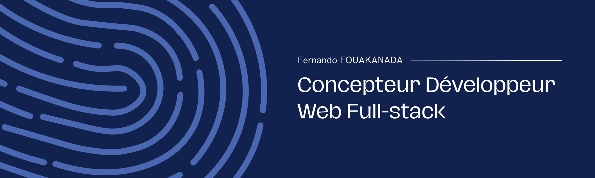

# -Fernando-Fouakanda

<h1 align="center">Salut 👋, Je suis Fernando</h1>

<h3 align="center">
  Développeur Web Full-Stack 
</h3>

Je fais de vos idées, projets et rêves une réalisation web concrète. Je transforme vos concepts en sites qui déchirent et en applis. Vos idées prennent vie, vos projets prennent de l’altitude et vos rêves deviennent interactifs ! Quand vous pensez impossible, moi je code possible.

